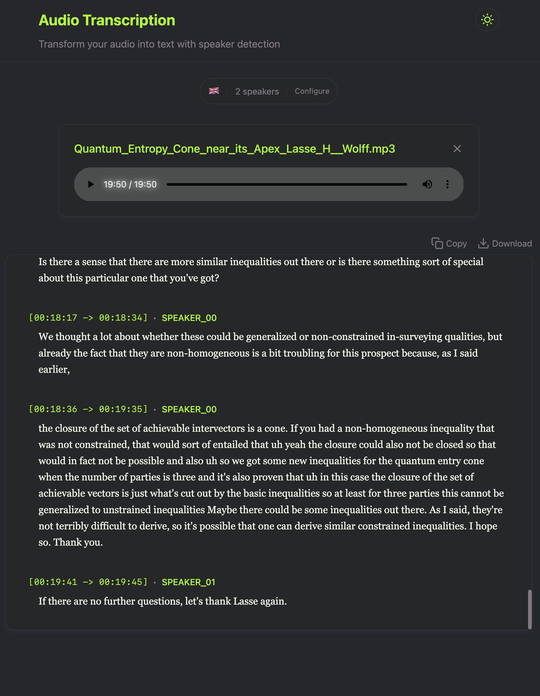

# neat-stt 🎙️

A modern speech-to-text (STT) service with a sleek frontend built using Remix and a powerful backend powered by FastAPI. This project combines state-of-the-art machine learning models with a beautiful, responsive user interface.

## Features ✨

- Audio transcription (will implement real time later)
- Speaker diarization (speaker identification)
- Beautiful, animated UI with a modern dark theme
- Multi-language support
- Configurable number of speakers
- Responsive design

## Tech Stack 🛠️

### Frontend
- [Remix](https://remix.run/) - Modern web framework
- TypeScript - Type-safe JavaScript
- Tailwind CSS - Utility-first CSS framework
- React - UI library

### Backend
- FastAPI - Modern Python web framework
- Whisper - OpenAI's speech recognition model
- PyAnnote - Speaker diarization
- PyTorch - Machine learning framework



## Getting Started 🚀

### Prerequisites
- Node.js >= 20.0.0
- Python >= 3.8
- pip

### Backend Setup

1. Navigate to the backend directory:
bash
cd backend

2. Install dependencies:

```bash
pip install -r requirements.txt
```


3. Create a `.env` file with your configuration

4. Start the backend server:
```bash
uvicorn src.main:app --reload
```


### Frontend Setup

1. Navigate to the frontend directory:
```bash
cd frontend
```
2. Install dependencies:
```bash
npm install
```

3. Start the frontend server:
```bash
npm run dev
```


The application will be available at `http://localhost:5173`

## Development 🔧

The project uses modern development tools and practices:

- ESLint for JavaScript/TypeScript linting
- Ruff for Python linting
- Tailwind CSS for styling
- TypeScript for type safety
- Vite for fast development and building

## License 📝

This project is licensed under the MIT License - see the LICENSE file for details.

## Contributing 🤝

Contributions are welcome! Feel free to submit issues and pull requests.

1. Fork the repository
2. Create your feature branch (`git checkout -b feature/amazing-feature`)
3. Commit your changes (`git commit -m 'Add some amazing feature'`)
4. Push to the branch (`git push origin feature/amazing-feature`)
5. Open a Pull Request

## Acknowledgments 🙏

- OpenAI's Whisper model for speech recognition
- PyAnnote for speaker diarization
- The Remix team for their excellent web framework