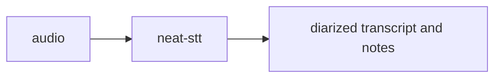

# neat-stt 🎙️

A modern speech-to-text (STT) and note-taking service.
This project combines state-of-the-art machine learning models with a beautiful, responsive user interface.

Built and developed for Silicon Macs (I have an M1 Max), but should work on other platforms as well.

How it works on a very simple level:

## Features ✨

- Audio transcription (will implement real time later)
- Speaker diarization (speaker identification)
- LLM-based note generation
- Beautiful, animated UI with a modern dark theme
- Multi-language support
- Configurable number of speakers
- Responsive design

## Tech Stack 🛠️

### Frontend
- [Remix](https://remix.run/) - Modern web framework
- TypeScript - Type-safe JavaScript
- Tailwind CSS - Utility-first CSS framework
- React - UI library

### Backend (python)
- FastAPI - Modern Python web framework
- Whisper - OpenAI's speech recognition model
- PyAnnote - Speaker diarization
- PyTorch - Machine learning framework
- Llama.cpp - Large language model inference
- HuggingFace transformers - Machine learning models

## Getting Started 🚀

See [docs/setup.md](./docs/setup.md) for more details.

## Development 🔧

The project uses modern development tools and practices:

- ESLint for JavaScript/TypeScript linting
- Ruff for Python linting
- Tailwind CSS for styling
- TypeScript for type safety
- Vite for fast development and building

## License 📝

This project is licensed under the MIT License - see the LICENSE file for details.

## Contributing 🤝

Contributions are welcome! Feel free to submit issues and pull requests.

1. Fork the repository
2. Create your feature branch (`git checkout -b feature/amazing-feature`)
3. Commit your changes (`git commit -m 'Add some amazing feature'`)
4. Push to the branch (`git push origin feature/amazing-feature`)
5. Open a Pull Request

## Acknowledgments 🙏

- OpenAI's Whisper model for speech recognition
- PyAnnote for speaker diarization
- The Remix team for their excellent web framework
- [llama.cpp](https://github.com/ggerganov/llama.cpp) for the large language model inference
- [HuggingFace](https://huggingface.co/) for the machine learning models
- [Cursor](https://www.cursor.com/) for the code editor that turned me from a backend developer into a full-stack developer with the power of "tabtabtabtab" lol.